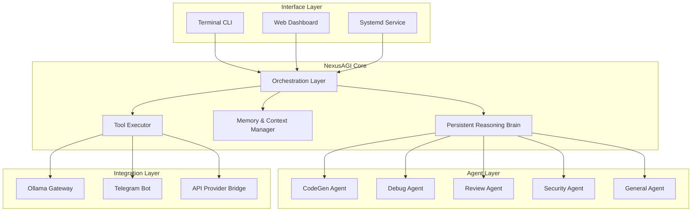
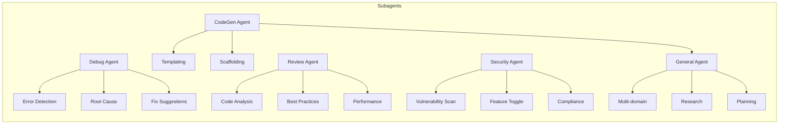
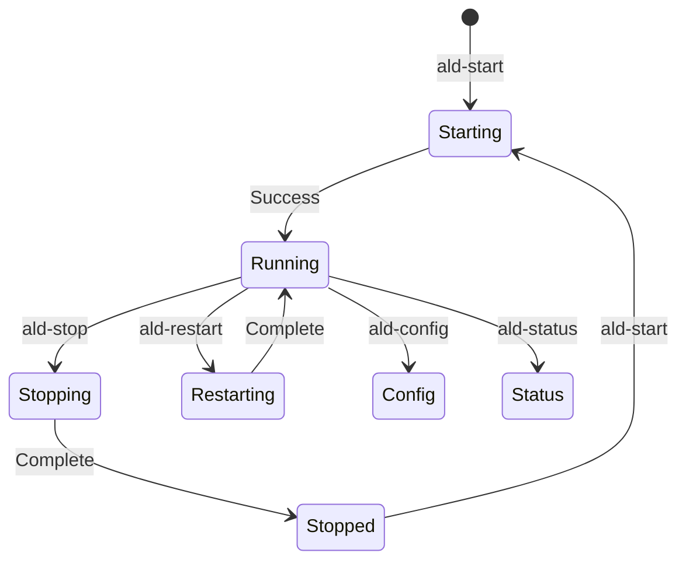
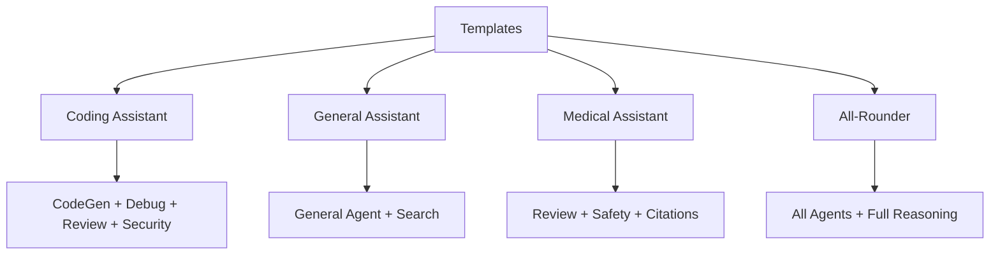

# ALD-01 Project Proposal: NexusAGI — Autonomous General Intelligence System

**Project Name:** NexusAGI (Advanced Local Desktop AI Gateway)  
**Project Type:** Terminal-centric AGI System with Web Dashboard  
**Proposal Date:** February 2026  
**Architecture:** Multi-Agent Orchestration with Persistent Reasoning Brain

---

## 1. Executive Summary

NexusAGI is a terminal-first autonomous AI system inspired by OpenCLAW architecture, designed as a persistent reasoning brain that runs continuously on local hardware. The system integrates seamlessly with Ollama for local AI processing, Telegram for messaging, and supports multiple AI providers through OpenAI-compatible APIs.

The system features five specialized subagents with distinct expertise, all configurable via terminal commands. It provides systemd-style process management (ald-start, ald-stop, ald-restart, ald-status, ald-config), automatic startup on boot, and a comprehensive local web dashboard displaying real-time system metrics, agent activities, and decision logs.

Key capabilities include:
- **AGI-level intelligence** with continuous background reasoning
- **Self-thinking processes** that autonomously analyze and improve
- **Multi-provider support** with automatic connection testing
- **Cross-platform installation** with automatic dependency management
- **Persistent reasoning brain** that operates 24/7 after startup

---

## 2. Architecture Overview

### 2.1 System Architecture



### 2.2 Component Responsibilities

| Component | Responsibility |
|-----------|---------------|
| **Orchestration Layer** | Coordinates all agents, manages task queues, routes requests |
| **Persistent Reasoning Brain** | Continuous background thought process, autonomous decisions |
| **Memory & Context Manager** | Maintains conversation history, learned patterns, user preferences |
| **Tool Executor** | Executes code, API calls, file operations, system commands |
| **Ollama Gateway** | Manages local LLM connections, model loading, inference |
| **Telegram Bot** | Bi-directional messaging, command handling, notifications |
| **API Provider Bridge** | Unified interface for external AI APIs |

---

## 3. Core Features

### 3.1 Five Specialized Subagents



#### Agent 1: CodeGen Agent (code_gen)
- **Expertise:** Software development, scaffolding, templating
- **Capabilities:**
  - Generate code in 50+ languages from natural language
  - Create project scaffolds and boilerplates
  - Generate SQL queries, APIs, configurations
  - Build complete file structures
- **Configuration:**
  ```
  ald-config agent code_gen --model <model> --temperature <0-1> --max_tokens <n>
  ```

#### Agent 2: Debug Agent (debug)
- **Expertise:** Error detection, troubleshooting, root cause analysis
- **Capabilities:**
  - Analyze error messages and stack traces
  - Identify bugs in provided code
  - Suggest fixes with explanations
  - Run diagnostic commands
- **Configuration:**
  ```
  ald-config agent debug --model <model> --auto-fix <true/false> --explain-level <brief/detailed>
  ```

#### Agent 3: Code Review Agent (review)
- **Expertise:** Code quality, security, performance optimization
- **Capabilities:**
  - Comprehensive code review with scoring
  - Security vulnerability detection
  - Performance bottleneck identification
  - Best practices enforcement
- **Configuration:**
  ```
  ald-config agent review --model <model> --security-first <true/false> --strictness <1-5>
  ```

#### Agent 4: Security Feature Toggle Agent (security)
- **Expertise:** Security controls, feature flags, compliance
- **Capabilities:**
  - Enable/disable security features
  - Manage feature toggles via natural language
  - Generate security reports
  - Compliance checking (GDPR, SOC2, etc.)
- **Configuration:**
  ```
  ald-config agent security --audit-mode <basic/full> --auto-disable <true/false>
  ```

#### Agent 5: General Purpose Agent (general)
- **Expertise:** Versatile, multi-domain assistance
- **Capabilities:**
  - Answer questions across domains
  - Research and summarize topics
  - Assist with writing tasks
  - Handle any unclassified requests
- **Configuration:**
  ```
  ald-config agent general --model <model> --creativity <0-1> --search-enabled <true/false>
  ```

### 3.2 Terminal Commands



#### Core Commands

| Command | Description | Example |
|---------|-------------|---------|
| `ald-start` | Start NexusAGI services | `ald-start` or `ald-start --gateway` |
| `ald-stop` | Gracefully stop all services | `ald-stop` or `ald-stop --force` |
| `ald-restart` | Restart all services | `ald-restart` |
| `ald-status` | Show system status | `ald-status --verbose` |
| `ald-config` | Configure system/agents | See below |
| `ald-agent <name> <prompt>` | Invoke specific agent | `ald-agent code_gen "Write a React component"` |
| `ald-ask <question>` | General query | `ald-ask "How do I center a div?"` |
| `ald-telegram` | Telegram management | `ald-telegram enable --token <token>` |
| `ald-provider` | Provider management | `ald-provider add openai <api_key>` |
| `ald-template` | Template management | `ald-template list` |
| `ald-dashboard` | Dashboard control | `ald-dashboard start --port 3000` |
| `ald-logs` | View system logs | `ald-logs --tail 100 --agent <name>` |
| `ald-update` | Update system | `ald-update --check` |

#### Configuration Commands

```bash
# Configure specific agent
ald-config agent <name> --model <model> --temperature <0-1>

# Add AI provider
ald-config provider add <name> --api-url <url> --api-key <key>

# Configure reasoning brain
ald-config brain --enabled <true/false> --interval <seconds> --model <model>

# Configure Telegram
ald-config telegram --token <bot_token> --chat-id <chat_id>

# Configure auto-start
ald-config autostart enable
ald-config autostart disable
```

### 3.3 AGI Capabilities

#### Self-Thinking Process
```
┌─────────────────────────────────────────────┐
│         PERSISTENT REASONING BRAIN          │
├─────────────────────────────────────────────┤
│  1. Background Loop (continuous)           │
│     ├─ Analyze recent interactions         │
│     ├─ Identify patterns & improvements     │
│     ├─ Generate hypotheses                  │
│     ├─ Test assumptions                     │
│     └─ Update internal knowledge            │
│                                              │
│  2. Proactive Reasoning                     │
│     ├─ Anticipate user needs                │
│     ├─ Prepare responses in advance         │
│     ├─ Optimize tool usage                  │
│     └─ Self-correct when needed             │
│                                              │
│  3. Autonomous Decision Making              │
│     ├─ Evaluate available tools             │
│     ├─ Choose optimal action path          │
│     ├─ Execute with user values             │
│     └─ Learn from outcomes                  │
└─────────────────────────────────────────────┘
```

#### Continuous Background Reasoning
- Runs as a background process after initial startup
- Uses all available tools (Ollama, APIs, user settings)
- Maintains persistent memory across sessions
- Can initiate conversations proactively
- Operates autonomously while remaining controllable

### 3.4 Multi-Provider Integration

#### Supported Providers
- **Ollama** (local) - llama3.3, codellama, mistral, etc.
- **OpenAI** - GPT-4o, GPT-4o-mini, o1-preview
- **Anthropic** - Claude 3.5 Sonnet, Claude 3 Opus
- **Google** - Gemini 2.0 Flash, Pro
- **xAI** - Grok 2
- **Any OpenAI-compatible API** - LM Studio, LocalAI, custom endpoints

#### Provider Configuration
```bash
# Add Ollama (auto-detected)
ald-provider add ollama --host localhost:11434

# Add OpenAI
ald-provider add openai --api-key sk-...

# Add custom OpenAI-compatible
ald-provider add custom --name "My AI" --api-url https://api.myservice.com/v1 --api-key ...

# Test all providers
ald-provider test-all

# View status
ald-provider status
```

#### Connection Testing & Visual Indicators
```
┌─────────────────────────────────────────────┐
│         PROVIDER CONNECTION STATUS          │
├─────────────────────────────────────────────┤
│  ● Ollama (localhost:11434)      [ONLINE]  │  ← Green
│  ○ OpenAI (api.openai.com)       [OFFLINE] │  ← Red
│  ● Anthropic (api.anthropic.com) [ONLINE]  │  ← Green
│  ● Google (generativelanguage)  [ONLINE]   │  ← Green
│  ○ Custom (api.myservice.com)   [ERROR]    │  ← Red
└─────────────────────────────────────────────┘

Legend: ● Connected  ○ Disconnected  ⚠ Warning
```

### 3.5 Pre-Configured Templates



#### Template 1: Coding Assistant
```
Purpose: Software development workflow
Active Agents: CodeGen, Debug, Review, Security
Configuration:
  - Default model: codellama:34b
  - Auto-review: enabled
  - Security scan: enabled
  - Max iterations: 5
```

#### Template 2: General Assistant
```
Purpose: General knowledge and assistance
Active Agents: General
Configuration:
  - Default model: llama3.3:70b
  - Web search: enabled
  - Creativity: 0.7
```

#### Template 3: Medical Assistant
```
Purpose: Healthcare information (accuracy & safety critical)
Active Agents: Review + General
Configuration:
  - Safety first: enabled
  - Citations required: true
  - Confidence scoring: enabled
  - Disclaimer: always shown
  - Model: claude-3-opus (high accuracy)
```

#### Template 4: All-Rounder
```
Purpose: Versatile all-purpose AI
Active Agents: All
Configuration:
  - Dynamic agent routing
  - Full reasoning brain
  - All tools enabled
  - Best model per task
```

### 3.6 Telegram Integration

| Feature | Description |
|---------|-------------|
| **Bot Commands** | /start, /ask, /agent, /status, /help |
| **Notifications** | Task completion, agent activity, system alerts |
| **Voice Input** | Voice messages transcribed and processed |
| **File Processing** | Code files, documents analyzed |
| **Group Chat** | Support for group conversations |

### 3.7 Web Dashboard

#### Dashboard Components

```
┌────────────────────────────────────────────────────────────────────┐
│                        NEXUSAGI DASHBOARD                          │
├────────────────────────────────────────────────────────────────────┤
│  ┌──────────┐  ┌──────────┐  ┌──────────┐  ┌──────────┐         │
│  │ System   │  │ CPU      │  │ Memory   │  │ Network  │         │
│  │ Status   │  │ Usage    │  │ Usage    │  │ Status   │         │
│  │ ● Online │  │ ████░░  │  │ ███░░░░  │  │ ● UP    │         │
│  │ Uptime   │  │ 45%      │  │ 2.1GB    │  │ ↓↑ OK   │         │
│  │ 2d 14h   │  │          │  │          │  │         │         │
│  └──────────┘  └──────────┘  └──────────┘  └──────────┘         │
├────────────────────────────────────────────────────────────────────┤
│  AGENT HEALTH                                                      │
│  ┌─────────┬────────┬────────┬────────┬────────┐                 │
│  │CodeGen  │ Debug  │ Review │ Secur  │ General│                 │
│  │ ● ACTIVE│ ● ACTIVE│ ○ IDLE │ ● ACTIVE│ ● ACTIVE│              │
│  │ 1,234   │   567  │   234  │   123  │  3,456  │  tasks        │
│  │ runs    │ fixes  │ reviews│ toggles│ queries │               │
│  └─────────┴────────┴────────┴────────┴────────┘                 │
├────────────────────────────────────────────────────────────────────┤
│  REAL-TIME ACTIVITY VISUALIZER                                     │
│  ┌──────────────────────────────────────────────────────────────┐│
│  │ ● Agent:CodeGen  Task: "Create REST API"     [COMPLETED]      ││
│  │ ● Agent:Debug    Analyzing error in main.py  [PROCESSING]    ││
│  │ ● Agent:Review   Security scan on project    [QUEUED]        ││
│  │ ● Brain:Reason  Evaluating optimization...   [THINKING]    ││
│  └──────────────────────────────────────────────────────────────┘│
├────────────────────────────────────────────────────────────────────┤
│  DECISION LOG (Recent)                                            │
│  ┌──────────────────────────────────────────────────────────────┐│
│  │ [14:32:15] Chose CodeGen for "build login" - highest match   ││
│  │ [14:32:10] Routing query to General - no specific agent      ││
│  │ [14:31:58] Security Agent flagged: hardcoded API key found    ││
│  │ [14:31:45] Self-correction: switching to faster model        ││
│  └──────────────────────────────────────────────────────────────┘│
├────────────────────────────────────────────────────────────────────┤
│  LEARNING PROGRESS                                                 │
│  │ Patterns Learned: 1,234  │  Accuracy: 87%  │  Score: 9.2    ││
│  └────────────────────────────────────────────────────────────────┤│
└────────────────────────────────────────────────────────────────────┘
```

#### Dashboard Features
- **System Status:** CPU, RAM, network, uptime
- **Agent Health:** Active/idle, tasks completed, errors
- **Real-time Visualizer:** Live task stream, agent activities
- **Decision Logs:** AI decision history with reasoning
- **Learning Metrics:** Patterns learned, accuracy scores
- **Configuration Panel:** Edit settings, manage providers
- **Logs Viewer:** Tail system logs in real-time

---

## 4. Technical Implementation

### 4.1 Technology Stack

| Layer | Technology | Rationale |
|-------|------------|-----------|
| **Runtime** | Node.js 22 + Bun | Fast execution, native TypeScript |
| **Language** | TypeScript | Type safety, better DX |
| **AI Integration** | Ollama SDK, OpenAI SDK | Universal LLM access |
| **Orchestration** | Event-driven architecture | Scalable agent coordination |
| **Memory** | SQLite + Vector extension | Persistent storage + semantic search |
| **CLI** | Commander.js / Ink | Beautiful terminal interfaces |
| **Dashboard** | Express + Socket.io | Real-time web interface |
| **Telegram** | GrammY / node-telegram-bot-api | Bot framework |
| **Process Management** | Node.js Cluster + PM2 | Production process management |
| **Auto-start** | Systemd (Linux), Launchd (macOS), Registry (Windows) | OS-native startup |

### 4.2 Project Structure

```
nexusagi/
├── src/
│   ├── core/
│   │   ├── orchestrator.ts       # Task coordination
│   │   ├── reasoning-brain.ts   # Continuous reasoning
│   │   ├── memory-manager.ts    # Context & history
│   │   └── tool-executor.ts     # Tool execution
│   ├── agents/
│   │   ├── base-agent.ts        # Agent base class
│   │   ├── code-gen.ts          # Code generation agent
│   │   ├── debug-agent.ts      # Debugging agent
│   │   ├── review-agent.ts     # Code review agent
│   │   ├── security-agent.ts   # Security toggle agent
│   │   └── general-agent.ts     # General purpose agent
│   ├── providers/
│   │   ├── ollama.ts            # Ollama integration
│   │   ├── openai.ts            # OpenAI provider
│   │   ├── anthropic.ts         # Anthropic provider
│   │   ├── google.ts            # Google provider
│   │   └── bridge.ts            # OpenAI-compatible bridge
│   ├── integrations/
│   │   ├── telegram.ts          # Telegram bot
│   │   └── dashboard.ts         # Web dashboard
│   ├── cli/
│   │   ├── commands.ts          # CLI commands
│   │   ├── prompt.ts            # Interactive prompts
│   │   └── ansi.ts              # Terminal styling
│   ├── services/
│   │   ├── autostart.ts         # Auto-start configuration
│   │   ├── logging.ts           # Logging system
│   │   └── health.ts            # Health monitoring
│   └── utils/
│       ├── config.ts            # Configuration management
│       └── installer.ts         # Cross-platform installer
├── templates/
│   ├── coding-assistant.json
│   ├── general-assistant.json
│   ├── medical-assistant.json
│   └── all-rounder.json
├── service/
│   ├── nexusagi.service         # systemd unit
│   ├── nexusagi.plist           # macOS launchd
│   └── nexusagi.ps1             # Windows service
├── dashboard/
│   ├── public/
│   │   └── index.html
│   └── src/
│       └── dashboard.ts
├── package.json
├── tsconfig.json
├── .env.example
└── README.md
```

### 4.3 Auto-Start Configuration

#### Linux (systemd)
```bash
# Install service
sudo cp service/nexusagi.service /etc/systemd/system/
sudo systemctl daemon-reload
sudo systemctl enable nexusagi

# Commands
sudo systemctl start nexusagi    # ald-start equivalent
sudo systemctl stop nexusagi     # ald-stop equivalent
sudo systemctl restart nexusagi  # ald-restart equivalent
sudo systemctl status nexusagi   # ald-status equivalent
```

#### macOS (launchd)
```bash
# Install service
cp service/nexusagi.plist ~/Library/LaunchAgents/com.nexusagi.agent.plist
launchctl load ~/Library/LaunchAgents/com.nexusagi.agent.plist
```

#### Windows (Service)
```powershell
# Install as Windows Service
sc create NexusAGI binPath= "C:\path\to\nexusagi.exe"
sc config NexusAGI start= auto
```

---

## 5. Cross-Platform Installation

### 5.1 Automated Installer

The installer automatically:
1. Detects host OS (Windows/Linux/macOS)
2. Checks for Node.js, installs if missing
3. Installs Ollama if not present (optional)
4. Clones/configures NexusAGI
5. Sets up auto-start service
6. Starts the gateway

```bash
# One-command installation
curl -sSL https://nexusagi.dev/install | bash

# Or for Windows (PowerShell)
irm https://nexusagi.dev/install.ps1 | iex
```

### 5.2 Installer Logic

```typescript
async function install() {
  const os = detectOS();
  
  // Step 1: Check dependencies
  const node = await checkCommand('node');
  if (!node) {
    if (os === 'windows') await installNodeWindows();
    else await installNodeUnix();
  }
  
  // Step 2: Clone repository
  await run('git clone https://github.com/nexusagi/nexusagi.git');
  
  // Step 3: Install dependencies
  await run('npm install');
  
  // Step 4: Configure autostart
  if (os === 'linux') await setupSystemd();
  else if (os === 'macos') await setupLaunchd();
  else if (os === 'windows') await setupWindowsService();
  
  // Step 5: Start service
  await run('ald-start --gateway');
  
  // Step 6: Open dashboard
  open('http://localhost:3000');
}
```

---

## 6. Configuration

### 6.1 Configuration File

```yaml
# ~/.nexusagi/config.yaml
system:
  name: NexusAGI
  version: "1.0.0"
  data_dir: ~/.nexusagi/data
  log_level: info
  port: 3000

reasoning:
  enabled: true
  interval: 30  # seconds
  model: llama3.3:70b
  max_thoughts: 10

agents:
  code_gen:
    enabled: true
    model: codellama:34b
    temperature: 0.3
    max_tokens: 4096
    
  debug:
    enabled: true
    model: mistral:7b
    auto_fix: false
    explain_level: detailed
    
  review:
    enabled: true
    model: llama3.3:70b
    strictness: 4
    security_first: true
    
  security:
    enabled: true
    audit_mode: full
    auto_disable: false
    
  general:
    enabled: true
    model: llama3.3:70b
    creativity: 0.7
    search_enabled: true

providers:
  ollama:
    enabled: true
    host: localhost:11434
    models:
      - llama3.3:70b
      - codellama:34b
      - mistral:7b
      
  openai:
    enabled: false
    api_key: ""
    base_url: https://api.openai.com/v1
    
  anthropic:
    enabled: false
    api_key: ""
    
telegram:
  enabled: false
  token: ""
  chat_ids: []

autostart:
  enabled: true
  gateway: true
  dashboard: true
```

---

## 7. Development Roadmap

### Phase 1: Foundation (Weeks 1-2)
- [ ] Project scaffolding with TypeScript
- [ ] Core orchestrator implementation
- [ ] Basic CLI commands (ald-start, ald-stop, ald-status)
- [ ] Ollama integration
- [ ] Basic agent framework

### Phase 2: Agent Implementation (Weeks 3-4)
- [ ] Implement all 5 subagents
- [ ] Agent configuration system
- [ ] Template system
- [ ] Memory management
- [ ] Tool execution framework

### Phase 3: Integrations (Weeks 5-6)
- [ ] Telegram bot integration
- [ ] Multi-provider support
- [ ] Connection testing with visual indicators
- [ ] OpenAI-compatible API bridge

### Phase 4: AGI Features (Weeks 7-8)
- [ ] Persistent reasoning brain
- [ ] Self-thinking process
- [ ] Autonomous decision making
- [ ] Background continuous operation

### Phase 5: Dashboard & Polish (Weeks 9-10)
- [ ] Web dashboard development
- [ ] Real-time visualizer
- [ ] Decision logs and metrics
- [ ] Cross-platform installer
- [ ] Auto-start services

---

## 8. Portfolio-Worthy Elements

This project demonstrates:

### Advanced AI Engineering
- [ ] Multi-agent orchestration
- [ ] RAG and memory management
- [ ] Continuous reasoning systems
- [ ] Autonomous decision-making
- [ ] Tool use and function calling

### Systems Programming
- [ ] Process management (systemd, launchd, Windows service)
- [ ] Cross-platform installation
- [ ] CLI development
- [ ] Event-driven architecture

### Real-time Systems
- [ ] WebSocket communications
- [ ] Live dashboard with Socket.io
- [ ] Real-time log streaming
- [ ] Agent activity visualization

### Full-Stack Development
- [ ] Node.js backend
- [ ] TypeScript throughout
- [ ] Web dashboard frontend
- [ ] Database design (SQLite)

### DevOps
- [ ] Cross-platform deployment
- [ ] Service management
- [ ] Logging and monitoring
- [ ] Auto-update systems

---

## 9. Conclusion

NexusAGI is a portfolio-defining project that showcases:

✅ **AGI-level intelligence** with continuous reasoning  
✅ **Multi-agent orchestration** with 5 specialized agents  
✅ **Deep systems integration** (Ollama, Telegram, APIs)  
✅ **Production-grade** process management  
✅ **Beautiful CLI** with systemd-style commands  
✅ **Real-time web dashboard** with activity visualizer  
✅ **Cross-platform** automated installation  
✅ **Self-improvement** and autonomous capabilities  

This system represents the cutting edge of what's possible with current AI technology and demonstrates mastery of AI engineering, systems programming, and modern software architecture.

---

*Proposal for ALD-01*  
*February 2026*
