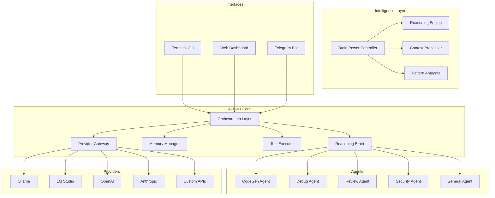
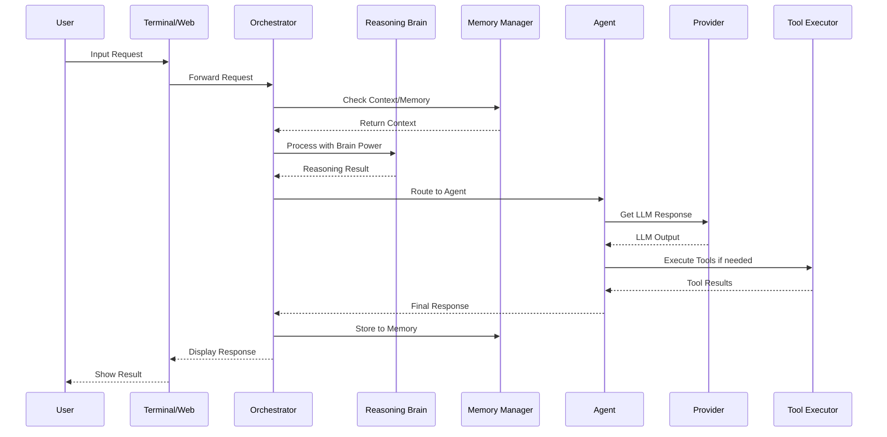
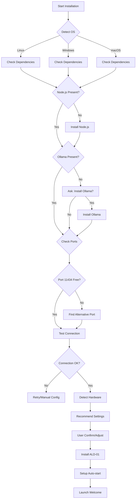
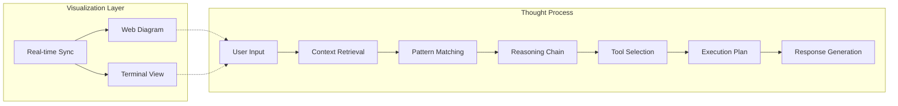
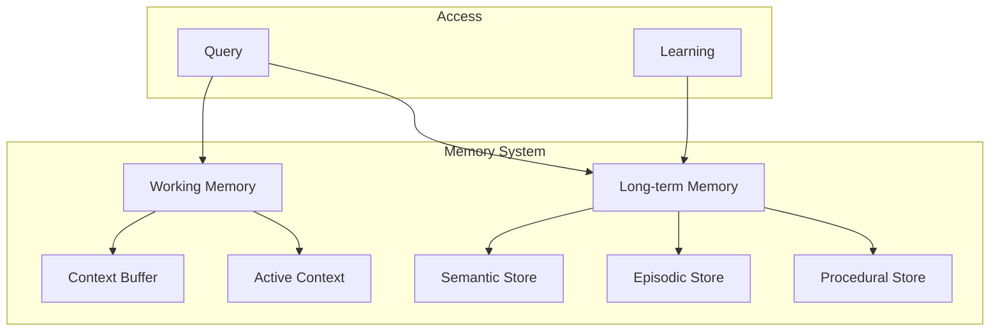
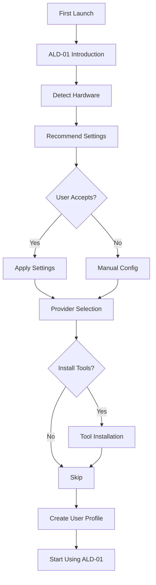
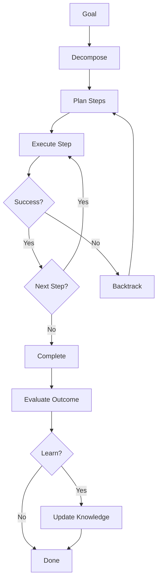

# ALD-01 Comprehensive Implementation Plan

**Project Name:** ALD-01 (Advanced Local Desktop Intelligence)  
**Version:** 1.0.0  
**Architecture:** Modular Multi-Agent System with Persistent Reasoning Brain  
**Target Platforms:** Linux, Windows, macOS, VPS environments

---

## Table of Contents

1. [System Architecture](#1-system-architecture)
2. [Intelligent Levels System](#2-intelligent-levels-system)
3. [Setup & Installation](#3-setup--installation)
4. [Doctor Diagnostic System](#4-doctor-diagnostic-system)
5. [Thinking Visualization](#5-thinking-visualization)
6. [Memory & Identity System](#6-memory--identity-system)
7. [Tools & MCP Integration](#7-tools--mcp-integration)
8. [Web Interface](#8-web-interface)
9. [Terminal Interface](#9-terminal-interface)
10. [Welcome & Onboarding](#10-welcome--onboarding)
11. [Continuous Learning](#11-continuous-learning)
12. [AGI Features](#12-agi-features)
13. [Robustness & Reliability](#13-robustness--reliability)
14. [Implementation Phases](#14-implementation-phases)

---

## 1. System Architecture

### 1.1 Core Components



### 1.2 Data Flow Architecture



### 1.3 Directory Structure

```
ald-01/
├── src/
│   ├── core/
│   │   ├── orchestrator.ts       # Task coordination
│   │   ├── reasoning-brain.ts    # Continuous reasoning
│   │   ├── brain-power.ts        # Intelligence level control
│   │   ├── memory-manager.ts     # Context & history
│   │   ├── tool-executor.ts      # Tool execution
│   │   └── provider-gateway.ts   # LLM provider management
│   ├── agents/
│   │   ├── base-agent.ts
│   │   ├── code-gen.ts
│   │   ├── debug-agent.ts
│   │   ├── review-agent.ts
│   │   ├── security-agent.ts
│   │   └── general-agent.ts
│   ├── providers/
│   │   ├── ollama.ts
│   │   ├── lm-studio.ts
│   │   ├── openai.ts
│   │   ├── anthropic.ts
│   │   ├── google.ts
│   │   └── bridge.ts
│   ├── mcp/
│   │   ├── protocol.ts          # MCP implementation
│   │   ├── tool-registry.ts      # Tool discovery
│   │   └── marketplace.ts        # Tool marketplace
│   ├── doctor/
│   │   ├── diagnostics.ts        # Health checks
│   │   ├── repair.ts             # Auto-repair
│   │   └── network.ts             # Network diagnostics
│   ├── visualization/
│   │   ├── thinking-display.ts   # Terminal display
│   │   ├── web-visualizer.ts     # Web diagrams
│   │   └── state-manager.ts       # Real-time sync
│   ├── interfaces/
│   │   ├── cli/
│   │   │   ├── commands.ts
│   │   │   ├── completion.ts
│   │   │   └── history.ts
│   │   ├── web/
│   │   │   ├── server.ts
│   │   │   ├── routes/
│   │   │   └── public/
│   │   └── telegram/
│   │       └── bot.ts
│   ├── onboarding/
│   │   ├── wizard.ts
│   │   ├── identity.ts
│   │   └── preferences.ts
│   ├── services/
│   │   ├── autostart.ts
│   │   ├── logging.ts
│   │   ├── health.ts
│   │   └── updater.ts
│   └── utils/
│       ├── config.ts
│       ├── installer.ts
│       └── hardware-detect.ts
├── templates/
│   ├── coding-assistant.json
│   ├── general-assistant.json
│   └── all-rounder.json
├── service/
│   ├── ald-01.service
│   ├── ald-01.plist
│   └── ald-01.ps1
├── package.json
├── tsconfig.json
└── README.md
```

---

## 2. Intelligent Levels System

### 2.1 Brain Power Scale

| Level | Name | Description | Use Case |
|-------|------|-------------|----------|
| 1 | Basic | Simple Q&A, minimal reasoning | Quick facts |
| 2 | Assistant | Standard helpful responses | General help |
| 3 | Capable | Moderate reasoning depth | Typical tasks |
| 4 | Proficient | Complex problem solving | Professional work |
| 5 | Advanced | Deep analysis and planning | Research |
| 6 | Expert | Specialized reasoning | Expert tasks |
| 7 | Master | Multi-domain synthesis | Complex projects |
| 8 | Superior | Advanced AGI reasoning | Sophisticated work |
| 9 | Near-AGI | Human-level reasoning | High-level tasks |
| 10 | AGI | Full autonomous reasoning | Any task |

### 2.2 Brain Power Configuration

```typescript
interface BrainPowerConfig {
  level: number;                    // 1-10
  reasoningDepth: number;           // iterations: 1-10
  contextWindow: number;            // tokens: 4k-128k
  toolAccess: 'none' | 'basic' | 'standard' | 'full';
  autonomousMode: boolean;
  creativityLevel: number;          // 0-1
  responseDetail: 'brief' | 'standard' | 'detailed' | 'exhaustive';
  predictionEnabled: boolean;
}

const BRAIN_POWER_PRESETS: Record<number, BrainPowerConfig> = {
  1: { level: 1, reasoningDepth: 1, contextWindow: 4096, toolAccess: 'none', autonomousMode: false, creativityLevel: 0.2, responseDetail: 'brief', predictionEnabled: false },
  2: { level: 2, reasoningDepth: 1, contextWindow: 4096, toolAccess: 'basic', autonomousMode: false, creativityLevel: 0.3, responseDetail: 'brief', predictionEnabled: false },
  3: { level: 3, reasoningDepth: 2, contextWindow: 8192, toolAccess: 'basic', autonomousMode: false, creativityLevel: 0.4, responseDetail: 'standard', predictionEnabled: false },
  4: { level: 4, reasoningDepth: 3, contextWindow: 16384, toolAccess: 'standard', autonomousMode: false, creativityLevel: 0.5, responseDetail: 'standard', predictionEnabled: true },
  5: { level: 5, reasoningDepth: 4, contextWindow: 32768, toolAccess: 'standard', autonomousMode: true, creativityLevel: 0.6, responseDetail: 'detailed', predictionEnabled: true },
  6: { level: 6, reasoningDepth: 5, contextWindow: 32768, toolAccess: 'standard', autonomousMode: true, creativityLevel: 0.7, responseDetail: 'detailed', predictionEnabled: true },
  7: { level: 7, reasoningDepth: 6, contextWindow: 65536, toolAccess: 'full', autonomousMode: true, creativityLevel: 0.7, responseDetail: 'detailed', predictionEnabled: true },
  8: { level: 8, reasoningDepth: 7, contextWindow: 65536, toolAccess: 'full', autonomousMode: true, creativityLevel: 0.8, responseDetail: 'exhaustive', predictionEnabled: true },
  9: { level: 9, reasoningDepth: 8, contextWindow: 128000, toolAccess: 'full', autonomousMode: true, creativityLevel: 0.85, responseDetail: 'exhaustive', predictionEnabled: true },
  10: { level: 10, reasoningDepth: 10, contextWindow: 128000, toolAccess: 'full', autonomousMode: true, creativityLevel: 0.9, responseDetail: 'exhaustive', predictionEnabled: true },
};
```

### 2.3 Hardware Auto-Detection

```typescript
interface HardwareProfile {
  cpuCores: number;
  memoryGB: number;
  gpuAvailable: boolean;
  gpuVRAM?: number;
  storageGB: number;
  recommendedLevel: number;
}

function detectHardware(): HardwareProfile {
  // Auto-detect and recommend brain power level
  const profile = {
    cpuCores: os.cpus().length,
    memoryGB: os.totalmem() / (1024 * 1024 * 1024),
    gpuAvailable: checkGPU(),
    storageGB: getStorageFree(),
  };
  
  // Calculate recommended level
  if (profile.memoryGB < 4) return { ...profile, recommendedLevel: 1 };
  if (profile.memoryGB < 8) return { ...profile, recommendedLevel: 2 };
  if (profile.memoryGB < 16 && !profile.gpuAvailable) return { ...profile, recommendedLevel: 3 };
  if (profile.memoryGB < 16 && profile.gpuAvailable) return { ...profile, recommendedLevel: 5 };
  if (profile.memoryGB < 32 && profile.gpuAvailable) return { ...profile, recommendedLevel: 7 };
  if (profile.memoryGB >= 32 && profile.gpuAvailable) return { ...profile, recommendedLevel: 9 };
  return { ...profile, recommendedLevel: 4 };
}
```

---

## 3. Setup & Installation

### 3.1 Installation Flow



### 3.2 Installation Commands

```bash
# One-command installation (Linux/macOS)
curl -sSL https://ald-01.dev/install | bash

# Windows PowerShell
irm https://ald-01.dev/install.ps1 | iex

# Interactive installer
ald-01 install
ald-01 install --interactive

# Provider setup
ald-01 provider add ollama
ald-01 provider add lm-studio
ald-01 provider add openai --api-key <key>

# Test installation
ald-01 doctor run
ald-01 doctor fix --all
```

---

## 4. Doctor Diagnostic System

### 4.1 Diagnostic Categories

| Category | Checks | Auto-Fix |
|----------|--------|----------|
| Dependencies | Node.js, npm, git versions | Yes |
| Ports | 11434, 3000, 8080 availability | Yes |
| Network | Connectivity to providers | No |
| Models | Ollama model availability | Yes |
| Permissions | File/directory access | Yes |
| Memory | System memory availability | No |
| Providers | API connection status | No |

### 4.2 Doctor Commands

```bash
# Run all diagnostics
ald-01 doctor run

# Run specific check
ald-01 doctor check ports
ald-01 doctor check network
ald-01 doctor check models
ald-01 doctor check dependencies

# Auto-fix issues
ald-01 doctor fix all
ald-01 doctor fix ports
ald-01 doctor fix permissions

# Test provider connections
ald-01 doctor test ollama
ald-01 doctor test openai
ald-01 doctor test all
```

### 4.3 Diagnostic Output Format

```
╔══════════════════════════════════════════════════════════╗
║                    ALD-01 DOCTOR REPORT                   ║
╠══════════════════════════════════════════════════════════╣
║  Status: ⚠ ISSUES FOUND (3 fixes available)               ║
╠══════════════════════════════════════════════════════════╣
║                                                          ║
║  DEPENDENCIES          [✗] NEEDS ATTENTION               ║
║    ├─ Node.js:         18.x  ✓ OK                       ║
║    ├─ npm:             10.x  ✓ OK                       ║
║    └─ git:             2.x   ✓ OK                       ║
║                                                          ║
║  PORTS                 [✗] NEEDS ATTENTION               ║
║    ├─ 11434 (Ollama):  ✗ IN USE                         ║
║    └─ 3000 (Dashboard): ✓ AVAILABLE                    ║
║                                                          ║
║  PROVIDERS             [✓] ALL ONLINE                   ║
║    ├─ Ollama:          ✓ CONNECTED                       ║
║    ├─ OpenAI:          ✓ CONNECTED                       ║
║    └─ Anthropic:       ✓ CONNECTED                       ║
║                                                          ║
║  MODELS                [✓] AVAILABLE                    ║
║    ├─ llama3.3:70b    ✓ READY                            ║
║    └─ codellama:34b   ✓ READY                            ║
║                                                          ║
╠══════════════════════════════════════════════════════════╣
║  RECOMMENDED FIXES:                                      ║
║    1. ald-01 doctor fix ports                            ║
║       → Configure Ollama on port 11435                  ║
║                                                          ║
╚══════════════════════════════════════════════════════════╝
```

---

## 5. Thinking Visualization

### 5.1 Visualization Architecture



### 5.2 Terminal Visualization

```
╔═══════════════════════════════════════════════════════════╗
║  ALD-01 THINKING                              [Level: 7]  ║
╠═══════════════════════════════════════════════════════════╣
║                                                            ║
║  INPUT: "Create a Python REST API with authentication"   ║
║                                                            ║
║  ├─ 📥 CONTEXT LOADED                                     ║
║  │   └─ Previous API projects: 3 found                   ║
║  │   └─ User preferences: Python, FastAPI                ║
║  │   └─ Recent patterns: JWT auth preferred              ║
║  │                                                           ║
║  ├─ 🧠 REASONING CHAIN                                    ║
║  │   ├─ Task decomposition: API scaffolding              ║
║  │   ├─ Tool selection: CodeGen + FileOps                ║
║  │   └─ Approach: Modular with auth layer                ║
║  │                                                           ║
║  ├─ 🔧 TOOL SELECTION                                     ║
║  │   ├─ Selected: code_gen (primary)                      ║
║  │   ├─ Tools: [file_write, code_analyze]                 ║
║  │   └─ Safety: sandboxed execution                       ║
║  │                                                           ║
║  ├─ ⚙️ EXECUTION                                           ║
║  │   ├─ Step 1: Generate main.py                          ║
║  │   ├─ Step 2: Generate auth.py                         ║
║  │   ├─ Step 3: Generate models.py                       ║
║  │   └─ Step 4: Generate requirements.txt                 ║
║  │                                                           ║
║  └─ ✅ COMPLETE (2.3s)                                    ║
║                                                            ║
╚═══════════════════════════════════════════════════════════╝
```

### 5.3 Web Interface Visualization

```typescript
interface ThoughtNode {
  id: string;
  type: 'input' | 'context' | 'reasoning' | 'tool' | 'execution' | 'output';
  label: string;
  status: 'pending' | 'processing' | 'complete' | 'error';
  children?: ThoughtNode[];
  metadata?: Record<string, any>;
  timestamp: Date;
}
```

---

## 6. Memory & Identity System

### 6.1 Memory Architecture



### 6.2 Memory Types

| Type | Capacity | Retention | Usage |
|------|----------|-----------|-------|
| Working | 100 tokens | Seconds | Current task |
| Episodic | 10,000 events | Sessions | Conversation history |
| Semantic | Unlimited | Permanent | Knowledge base |
| Procedural | Unlimited | Permanent | Skills & patterns |
| Identity | Limited | Permanent | User profiles |

### 6.3 Identity System

```typescript
interface Identity {
  id: string;
  name: string;
  personality: PersonalityProfile;
  preferences: UserPreferences;
  interactionPatterns: Pattern[];
  learningHistory: LearningRecord[];
}

interface PersonalityProfile {
  tone: 'formal' | 'casual' | 'friendly' | 'professional';
  verbosity: number;          // 0-1
  humor: number;              // 0-1
  empathy: number;            // 0-1
  assertiveness: number;      // 0-1
  creativity: number;         // 0-1
}
```

---

## 7. Tools & MCP Integration

### 7.1 MCP Protocol Implementation

```typescript
interface MCPTool {
  id: string;
  name: string;
  description: string;
  category: 'search' | 'file' | 'code' | 'api' | 'automation' | 'custom';
  schema: ToolSchema;
  enabled: boolean;
  source: 'built-in' | 'marketplace' | 'user-defined';
  permissions: string[];
}

interface MCPMessage {
  jsonrpc: '2.0';
  id: string;
  method: string;
  params?: Record<string, any>;
  result?: any;
  error?: RPCError;
}
```

### 7.2 Built-in Tools

| Tool | Description | Category |
|------|-------------|----------|
| web_search | Search the internet | search |
| file_read | Read file contents | file |
| file_write | Write to files | file |
| file_list | List directory contents | file |
| code_execute | Execute code (sandboxed) | code |
| code_analyze | Analyze code quality | code |
| http_request | Make HTTP requests | api |
| terminal | Run terminal commands | automation |
| memory_search | Search memory | system |

### 7.3 Tool Marketplace

```typescript
interface MarketplaceTool {
  id: string;
  name: string;
  description: string;
  provider: string;
  category: string;
  pricing: 'free' | 'freemium' | 'paid';
  installCommand: string;
  configSchema: JSONSchema;
  rating: number;
  installs: number;
}
```

---

## 8. Web Interface

### 8.1 Dashboard Layout

```
┌─────────────────────────────────────────────────────────────────┐
│  ALD-01 Dashboard                                [Settings]    │
├─────────────────────────────────────────────────────────────────┤
│  ┌──────────────┐  ┌──────────────┐  ┌──────────────┐          │
│  │ Brain Power │  │   Memory     │  │  Providers   │          │
│  │    [7]      │  │   1.2 GB    │  │  3/4 Online  │          │
│  │  ACTIVE     │  │   1,234      │  │  ●●●○       │          │
│  └──────────────┘  └──────────────┘  └──────────────┘          │
├─────────────────────────────────────────────────────────────────┤
│  THINKING VISUALIZATION                                        │
│  ┌─────────────────────────────────────────────────────────┐   │
│  │  [Input] → [Context] → [Reasoning] → [Tools] → [Output]│   │
│  └─────────────────────────────────────────────────────────┘   │
├─────────────────────────────────────────────────────────────────┤
│  AGENT STATUS                                                  │
│  ┌────────┐ ┌────────┐ ┌────────┐ ┌────────┐ ┌────────┐       │
│  │CodeGen│ │ Debug  │ │Review  │ │ Secur  │ │General │       │
│  │  ●    │ │   ●    │ │   ○    │ │   ●    │ │   ●    │       │
│  └────────┘ └────────┘ └────────┘ └────────┘ └────────┘       │
├─────────────────────────────────────────────────────────────────┤
│  RECENT ACTIVITY                           [View All Logs]    │
│  • Generated REST API in 2.3s                                  │
│  • Analyzed 3 files for security                               │
│  • Memory updated: 5 new patterns                              │
└─────────────────────────────────────────────────────────────────┘
```

### 8.2 Settings Page

- Brain Power Configuration
- Provider Management
- Tool Configuration
- Memory Management
- Auto-start Settings
- Theme & Appearance

---

## 9. Terminal Interface

### 9.1 Command Structure

```bash
# Core commands
ald-01 start              # Start ALD-01
ald-01 stop               # Stop ALD-01
ald-01 restart            # Restart ALD-01
ald-01 status             # Show status
ald-01 config             # Configure settings

# Agent commands
ald-01 ask <question>     # General query
ald-01 agent <name>       # Invoke specific agent

# Provider commands
ald-01 provider list     # List providers
ald-01 provider test     # Test connections

# Tool commands
ald-01 tools list        # List available tools
ald-01 tools enable <id>  # Enable tool
ald-01 tools marketplace # Browse marketplace

# Doctor commands
ald-01 doctor run        # Run diagnostics
ald-01 doctor fix         # Auto-fix issues

# Thinking visualization
ald-01 think on          # Enable thinking display
ald-01 think off         # Disable thinking display
ald-01 think level       # Set detail level
```

### 9.2 Interactive Features

- Auto-completion with Tab
- Command history with Up/Down
- Syntax highlighting
- Real-time suggestions
- Colored output

---

## 10. Welcome & Onboarding

### 10.1 Welcome Flow



### 10.2 Welcome Screen

```
╔═══════════════════════════════════════════════════════════╗
║                                                           ║
║     ██████╗ ██╗  ██╗██╗   ██╗███████╗                   ║
║     ██╔══██╗██║  ██║╚██╗ ██╔╝██╔════╝                   ║
║     ██║  ██║███████║ ╚████╔╝ ███████╗                   ║
║     ██║  ██║██╔══██║  ╚██╔╝  ╚════██║                   ║
║     ██████╔╝██║  ██║   ██║   ███████║                   ║
║     ╚═════╝ ╚═╝  ╚═╝   ╚═╝   ╚══════╝                   ║
║                                                           ║
║              Advanced Local Desktop Intelligence          ║
║                      Version 1.0.0                         ║
║                                                           ║
╠═══════════════════════════════════════════════════════════╣
║                                                           ║
║  Hi! I'm ALD-01, your AI assistant.                       ║
║                                                           ║
║  I'll help you with:                                      ║
║    • Code generation and debugging                        ║
║    • File operations and automation                      ║
║    • Research and analysis                                ║
║    • And much more...                                     ║
║                                                           ║
║  Let's get you set up!                                    ║
║                                                           ║
║  Detected: 16GB RAM, 8 CPU cores                         ║
║  Recommended: Brain Power Level 5                        ║
║                                                           ║
║  [Accept Recommended]  [Configure Manually]              ║
║                                                           ║
╚═══════════════════════════════════════════════════════════╝
```

---

## 11. Continuous Learning

### 11.1 Learning System

```typescript
interface LearningSystem {
  // Pattern recognition
  recognizePatterns(interactions: Interaction[]): Pattern[];
  
  // Preference learning  
  learnPreferences(interactions: Interaction[]): UserPreference[];
  
  // Skill acquisition
  acquireSkill(tool: MCPTool): Promise<void>;
  
  // Knowledge updates
  checkForUpdates(): Promise<Update[]>;
  
  // Version management
  rollback(version: string): Promise<void>;
}
```

### 11.2 Update System

- Daily tool marketplace scan
- Weekly capability updates
- Monthly feature releases
- Version tracking with changelog
- One-click rollback

---

## 12. AGI Features

### 12.1 Advanced Reasoning

| Feature | Description |
|---------|-------------|
| Task Planning | Decompose complex tasks into steps |
| Backtracking | Revise reasoning when paths fail |
| Goal Decomposition | Break high-level goals into subgoals |
| Self-Correction | Identify and fix own errors |
| Cross-Domain | Synthesize knowledge from multiple areas |
| Creative Problem-Solving | Novel approaches to challenges |
| Predictive Assistance | Anticipate needs before asked |

### 12.2 Reasoning Loop



---

## 13. Robustness & Reliability

### 13.1 Error Handling

| Error Type | Response |
|------------|----------|
| API Failure | Fallback to alternative provider |
| Memory Full | Flush old contexts, warn user |
| Tool Error | Retry with exponential backoff |
| Network Loss | Queue requests, auto-retry |
| Crash | Restore from checkpoint |

### 13.2 Safety Features

- Sandboxed code execution
- Rate limiting
- Input validation
- Permission system
- Audit logging

---

## 14. Implementation Phases

### Phase 1: Foundation (Weeks 1-2)
- [ ] Project scaffolding
- [ ] Core orchestrator
- [ ] Basic CLI commands
- [ ] Ollama integration

### Phase 2: Intelligence (Weeks 3-4)
- [ ] Brain Power system
- [ ] Hardware detection
- [ ] Reasoning engine baseline

### Phase 3: Agents (Weeks 5-6)
- [ ] Five subagents
- [ ] Agent configuration
- [ ] Template system

### Phase 4: Integration (Weeks 7-8)
- [ ] Multi-provider support
- [ ] Tool executor
- [ ] MCP protocol

### Phase 5: Visualization (Weeks 9-10)
- [ ] Thinking display
- [ ] Web dashboard
- [ ] Real-time sync

### Phase 6: Intelligence (Weeks 11-12)
- [ ] Memory system
- [ ] Identity system
- [ ] Learning system

### Phase 7: Polish (Weeks 13-14)
- [ ] Doctor system
- [ ] Onboarding
- [ ] Auto-updater
- [ ] Cross-platform installer

### Phase 8: Testing (Weeks 15-16)
- [ ] Integration testing
- [ ] Security audit
- [ ] Performance optimization
- [ ] Documentation

---

## Summary

This implementation plan combines the existing NexusAGI proposal with the additional features from your requirements:

✅ **Core System** - Orchestrator, agents, providers  
✅ **Intelligent Levels** - Configurable brain power (1-10) with auto-detection  
✅ **Installation Wizards** - Automated cross-platform setup  
✅ **Doctor System** - Diagnostics and auto-repair  
✅ **Thinking Visualization** - Real-time n8n-style display  
✅ **Memory & Identity** - Persistent context and personality  
✅ **MCP Integration** - Tool marketplace  
✅ **Web Interface** - Full dashboard  
✅ **Terminal** - Rich CLI with completion  
✅ **Welcome** - Interactive onboarding  
✅ **Continuous Learning** - Auto-updates  
✅ **AGI Features** - Advanced reasoning  
✅ **Reliability** - Enterprise-grade error handling  

The plan is structured into 8 implementation phases over approximately 16 weeks.
